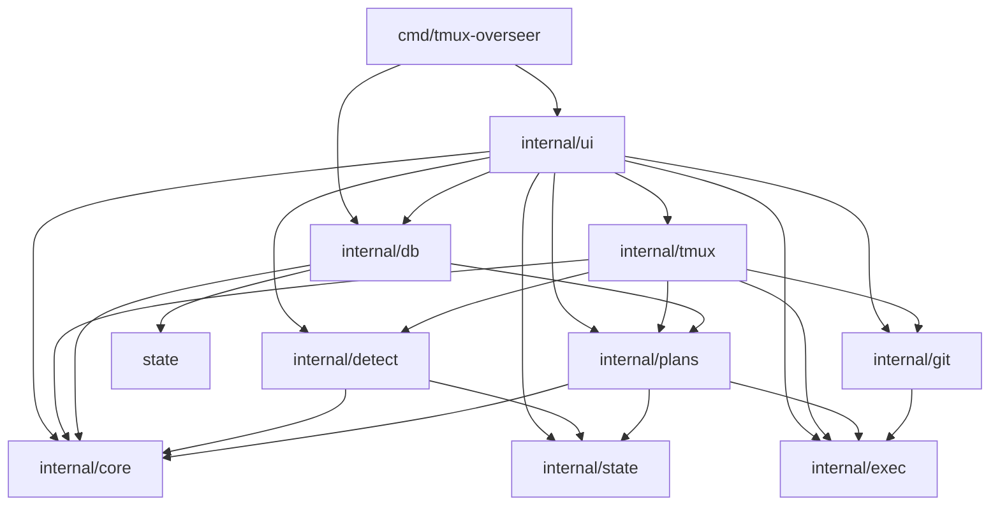
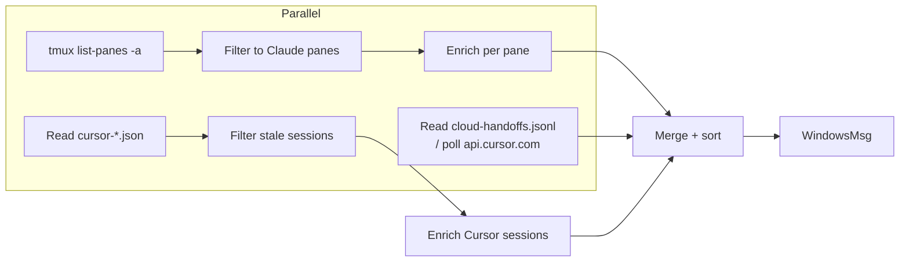
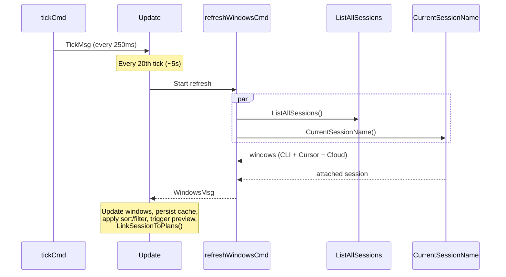

# 🏗️ Architecture

This document describes the internal architecture of `tmux-overseer` for contributors and curious readers.

## 📦 Package Overview

```
cmd/tmux-overseer/     Entry point — creates the Bubble Tea program; closes DuckDB on exit
internal/core/         Domain types, UI enums, message definitions, lipgloss styles
internal/db/           DuckDB database — schema migration, plan sync, activity tracking,
                       session-to-plan linking
internal/detect/       Claude CLI detection (hooks + terminal parsing), Cursor session
                       discovery, cloud agent detection, daily cost ledger
internal/exec/         Subprocess execution with configurable timeouts
internal/git/          Git info detection (branch, dirty, staged, worktree) with a
                       cross-refresh TTL cache, plus git commands (stage, commit, push,
                       fetch, worktree add/remove)
internal/plans/        Plan scanner — reads Cursor .plan.md files and Claude Code JSONL
                       conversations, resolves workspaces, merges both sources;
                       title generation via `claude -p` with override persistence
internal/state/        Scroll state, path helpers, selection persistence, disk caches for
                       sessions and plans
internal/tmux/         Tmux command wrappers — session discovery, pane capture, session
                       creation, switching (tmux panes + Cursor deeplinks)
internal/ui/           Bubble Tea model (split across multiple files), all view rendering
```

## 🔗 Package Dependencies



`core`, `state`, and `exec` sit at the bottom of the dependency graph and import nothing from the project. `db` depends on `plans` (for `FullResync`) and `core`, but is otherwise isolated. `tmux` is the heaviest orchestrator — it calls into `detect`, `git`, and `plans` during session discovery.

## 🫧 Bubble Tea Lifecycle

The app is built on [Bubble Tea](https://github.com/charmbracelet/bubbletea), a Go framework for terminal UIs using The Elm Architecture.

### 🏁 InitialModel

`InitialModel()` in `model.go` creates the initial `Model` struct. Before returning, it tries to load a sessions disk cache (`~/.claude-tmux/.claude-tmux-sessions.json`). If the cache exists and contains valid data, the model is populated with the cached windows and `loading` is set to `false`, which lets the very first `View()` call render a full session list instead of a loading screen.

### ▶️ Init

`Init()` returns three concurrent commands:

1. **`spinner.Tick`** — starts the animated Claude flower spinner
2. **`tickCmd()`** — fires `TickMsg` every 250ms (4 FPS) for auto-refresh and flash message timeouts
3. **`refreshWindowsCmd()`** — kicks off the first async session discovery

### ⚡ Update

The `Update` method dispatches on message type:

| Message | Source | Effect |
|---------|--------|--------|
| `tea.WindowSizeMsg` | Bubble Tea | Updates terminal dimensions and scroll viewport height |
| `TickMsg` | `tickCmd()` | Every 20 ticks (~5s) triggers `refreshWindowsCmd()` when in session list mode; clears flash messages after ~3s |
| `spinner.TickMsg` | Bubble Tea | Advances the spinner animation frame |
| `WindowsMsg` | `refreshWindowsCmd()` | Stores discovered sessions, records costs, persists cache, applies sort/filter, rebuilds item list, triggers preview and background plan preload, calls `db.LinkSessionToPlans()` |
| `PreviewMsg` | `fetchPreview()` | Updates the preview pane content (only if the pane ID still matches the current selection) |
| `PreviewDebounceMsg` | 150ms timer | Fires the actual preview fetch after debounce |
| `FilterDebounceMsg` | 100ms timer | Applies the filter text after debounce |
| `GitResultMsg` | Git commands | Shows a flash message; triggers a session refresh on success |
| `PlansMsg` | `loadPlansCmd()` | Stores plan entries, triggers a DuckDB sync in the background; if result came from stale disk cache, fires a background rescan |
| `TitleGeneratedMsg` | `generateTitleCmd()` | Persists the generated title override and refreshes the plans list |
| `SyncProgressMsg` | `forceSyncCmd()` | Updates sync progress display; on completion reloads plans and activity data |
| `ActivityDataMsg` | `loadActivityDataCmd()` | Stores heatmap grid and project summaries for the activity view |
| `tea.MouseMsg` | Bubble Tea | Click, double-click, and scroll wheel handling |
| `tea.KeyMsg` | Bubble Tea | Delegates to a mode-specific key handler |

### 🖼️ View

`View()` calls `renderApp()`, which dispatches by mode:

- **Loading** (`m.loading && len(m.windows) == 0`) — centred mascot with scanning spinners
- **`ModeHelp`** — full-screen help overlay
- **`ModePlans` / `ModePlanFilter`** — plans browser with grouped list
- **`ModeActivity`** — activity heatmap, project summaries, and day detail panel
- **Everything else** — `renderMainLayout()`: header (with tab bar), session list (or action menu), preview pane, status bar, footer

## 🔍 Session Discovery and Enrichment

Session discovery is the core data pipeline that runs every 5 seconds.

### 🔄 Pipeline



### 🖥️ CLI (tmux) Sessions

1. **Discovery** — A single `tmux list-panes -a -F` call returns all panes across all sessions. The output is filtered to panes whose current command matches `claude` (via `detect.IsClaudeCommand`).

2. **Enrichment** — For each Claude pane, an errgroup (capped at 8 workers) runs concurrently:
   - `tmux capture-pane` captures the last 15 lines of terminal output
   - `detect.EnrichWithHook()` reads `~/.claude-tmux/status-{paneID}.json` for hook-based status; falls back to terminal content parsing
   - `git.DetectInfoCached()` returns branch, dirty/staged status, and worktree info (with 10s TTL)

3. **Grouping** — Enriched panes are grouped into `ClaudeWindow` structs by `session:windowIndex`.

### 🖱️ Cursor Sessions

1. **Discovery** — `detect.ReadCursorSessions()` globs `~/.claude-tmux/cursor-*.json` and unmarshals each file into a `ClaudeWindow`. Files older than 20 minutes are considered stale and removed.

2. **Enrichment** — Git info is gathered in parallel (same errgroup pattern). If any Cursor sessions have a `ConversationID`, `plans.ResolvePlansForSessions()` is called to attach active plan progress (title + todo completion).

3. **Parallelism** — CLI and Cursor discovery run concurrently via goroutines in `ListAllSessions()`. `CurrentSessionName()` (which calls `tmux display-message`) also runs in parallel in `refreshWindowsCmd()`.

### ☁️ Cloud Sessions

1. **Local source** — `detect.ReadCloudSessions()` reads `~/.claude-tmux/cloud-handoffs.jsonl`, which is written by the Cursor hook script whenever a submitted prompt starts with `&`. Entries older than 24 hours are ignored.

2. **API source** — When `CURSOR_API_KEY` is set (or found in `~/.claude-tmux/config.json`), `api.cursor.com/v0/agents` is polled in the background with a 30-second TTL cache. The response is merged with local handoff data.

3. **Result** — Cloud sessions appear as `ClaudeWindow` entries with `Source = SourceCloud`, shown with a `[CLOUD]` badge. The action menu exposes any agent URL or PR URL returned by the API.

## 🪝 Hook System

Hooks are the recommended way to get accurate, real-time status. Without hooks, the tool falls back to parsing terminal output (less reliable).

### 🤖 Claude Code Hooks

**Script:** `scripts/status-hook.sh`

Claude Code invokes this script on lifecycle events. The script writes `~/.claude-tmux/status-{pane_id}.json` with:

```json
{
  "status": "working",
  "cost": 1.23,
  "model": "opus-4-6",
  "cwd": "/path/to/project",
  "timestamp": 1708300000
}
```

It also writes `.events.jsonl`, `.subagents.json`, and `.counters` files that expose subagent state, tool/prompt counts, and event history to the UI.

**Setup:** `scripts/setup-hooks.sh` registers the script in `~/.claude/settings.json`.

### 🖱️ Cursor IDE Hooks

**Script:** `scripts/cursor-status-hook.sh`

Cursor invokes this script with JSON on stdin for each agent lifecycle event. The script writes:

- `~/.claude-tmux/cursor-{conversation_id}.json` — status, model, workspace, CWD, plan title, subagent info, timestamp
- `~/.claude-tmux/cursor-{conversation_id}.log` — rolling activity log (last 50 lines) that powers the preview pane
- `~/.claude-tmux/cloud-handoffs.jsonl` — when a prompt starts with `&`, records a cloud handoff entry

| Event | Status Written |
|-------|----------------|
| `sessionStart` | idle |
| `beforeSubmitPrompt`, `preToolUse`, `postToolUse`, `subagentStop`, `preCompact` | working |
| `stop` | idle |
| `sessionEnd` | (removes status file) |

**Setup:** `scripts/setup-cursor-hooks.sh` registers the script in `~/.cursor/hooks.json`.

## 📋 Plans Pipeline

Plans are loaded on demand (preloaded in the background after the first session refresh), cached to disk, and synced to DuckDB for activity tracking.

### 🖱️ Cursor Plans

1. **Scan** — `plans.ScanCursorPlans()` globs `~/.cursor/plans/*.plan.md`
2. **Parse** — YAML frontmatter is extracted (name, overview, todos with status)
3. **Workspace resolution** — Two-step lookup:
   - `readPlanRegistry()` queries Cursor's `state.vscdb` SQLite database for `composer.planRegistry` (maps plan IDs to composer IDs)
   - `buildComposerWorkspaceMap()` walks `~/.cursor/projects/*/agent-transcripts/` to map composer IDs to filesystem paths

### 🤖 Claude Conversations

1. **Scan** — `plans.ScanClaudeConversations(limit)` walks `~/.claude/projects/` for JSONL files
2. **Sort** — Files are sorted by modification time; only the most recent `limit` (default 50) are parsed
3. **Parse** — The title is extracted from the first user message in the JSONL stream; the workspace is inferred from the project directory name

### ✨ Title Generation

When the user presses `t` on a plan, `plans.GenerateTitle()` runs `claude -p` with a short excerpt of the conversation and returns a one-line summary. Generated titles are persisted to `~/.claude-tmux/plan-title-overrides.json` and applied on every subsequent scan via `plans.ApplyTitleOverrides()`.

### 🔀 Merge and Display

`plans.ScanAll()` runs both scans in parallel using goroutines, then merges and sorts by `LastActive` descending. The UI groups the filtered results into collapsible `PlanGroup` structs, either by workspace path or by day.

## 🦆 DuckDB Database

All plan and activity data is stored in a local DuckDB file at `~/.claude-tmux/plans.duckdb`. The singleton connection is opened on first use and closed cleanly by `main()` via `defer db.Close()`.

### 🗄️ Schema

```sql
projects (workspace_path PK, name, first_seen_at, last_active_at)

plans (conv_id PK, workspace_path, source, title, overview, file_path,
       created_by, created_at, last_modified_at, status,
       total_todos, completed_todos)

plan_agents (plan_id, agent_id, role, first_seen_at)   -- PK: (plan_id, agent_id, role)

plan_todos (plan_id, todo_id, content, status)          -- PK: (plan_id, todo_id)

activity_events (workspace_path, plan_id, agent_id,
                 event_type, event_data, occurred_at)

daily_activity (workspace_path, activity_date,          -- PK: (workspace_path, activity_date)
                plans_created, plans_modified,
                todos_completed, conversations_started,
                composite_score)
```

### 🔄 Sync Flow

After every plan load, `db.SyncPlans()` diffs the scanned `PlanEntry` slice against the database:

1. Upsert each workspace into `projects`
2. For each plan: insert if new, update `last_modified_at` if the todo counts changed
3. Emit `activity_events` rows for creates, modifications, and todo completions
4. Recompute `daily_activity` aggregate rows

`db.FullResync()` (triggered by `S` in the plans view) truncates all tables and resyncs from scratch — useful after upgrading workspace resolution logic.

`db.LinkSessionToPlans()` is called after each session refresh to insert `plan_agents` rows when a live session matches an active plan title.

### 📊 Activity Queries

| Function | Returns |
|----------|---------|
| `GetActivityGrid(weeks)` | One row per day for the heatmap; `composite_score` drives colour intensity |
| `GetProjectSummaries()` | Top projects ranked by total score, with plan/todo counts |
| `GetDayDetail(date)` | Plans touched and todos completed for a specific day |

Composite score weights: plan created ×3, todo completed ×2, plan modified ×1, conversation started ×1.

## 📅 Activity View

The activity view (`ModeActivity`, opened with `a`) is a read-only dashboard over the DuckDB data.

```
┌─ Heatmap (26 weeks) ──────────────────────────────────────────┐
│ Sun ░░░░▒▒▓▓██░░░░▒▓██ ...                                     │
│ Mon ░░░░▒▒▓▓░░▒▓██░░░░ ...                                     │
│ ...                                                             │
└───────────────────────────────────────────────────────────────┘
┌─ Projects ────────────────────────────────────────────────────┐
│ my-project            ████████████░░░░  14/18 todos  score 42  │
│ tmux-overseer        ████████░░░░░░░░   8/12 todos  score 28  │
└───────────────────────────────────────────────────────────────┘
┌─ Day detail (Tue Mar 11) ─────────────────────────────────────┐
│ 3 plans touched, 7 todos completed                            │
│   my-project  ·  Improve load detection, Fix retry logic       │
└───────────────────────────────────────────────────────────────┘
```

- Navigating the heatmap with `←/→` updates the day detail panel.
- `↑/↓` scrolls the project list.
- Data is loaded via `loadActivityDataCmd()` which queries DuckDB on a background goroutine and returns `ActivityDataMsg`.

## 💾 Caching Layers

| Cache | Location | TTL | Strategy |
|-------|----------|-----|----------|
| **Git info** | In-memory (`git/info.go`) | 10s per path | TTL-based; invalidated after git operations |
| **Day costs** | In-memory (`detect/costs.go`) | 5s | TTL-based; invalidated on each new cost write |
| **Plan registry** | In-memory (`plans/cursor_plans.go`) | 30s | TTL-based; caches the SQLite query result |
| **Cloud agents** | In-memory (`detect/cloud.go`) | 30s | TTL-based; API response cached between poll cycles |
| **Sessions disk cache** | `~/.claude-tmux/.claude-tmux-sessions.json` | None | Written after every successful refresh; loaded at startup for instant first frame |
| **Plans disk cache** | `~/.claude-tmux/.claude-tmux-plans.json` | 60s | Stale-while-revalidate: if fresh, served directly; if stale, served immediately then refreshed in background |
| **DuckDB** | `~/.claude-tmux/plans.duckdb` | Permanent | Updated incrementally on each plan sync; queried directly for activity data |

## 🔁 Auto-Refresh Cycle



The tick fires every 250ms. Every 20th tick (~5 seconds), if the UI is in session list mode, a full refresh is triggered. `ListAllSessions()` runs CLI, Cursor, and Cloud discovery concurrently; git enrichment uses an errgroup with up to 8 workers.

## 🗂️ Persisted State

All persistent state lives under `~/.claude-tmux/`:

| File | Purpose |
|------|---------|
| `~/.claude-tmux-state` | Last selected pane ID (restored on startup) |
| `~/.claude-tmux/.claude-tmux-sessions.json` | Sessions disk cache (instant first frame) |
| `~/.claude-tmux/.claude-tmux-plans.json` | Plans disk cache (stale-while-revalidate) |
| `~/.claude-tmux/plans.duckdb` | DuckDB database (plans, activity events, daily aggregates) |
| `~/.claude-tmux/plan-title-overrides.json` | User-confirmed plan titles generated via `claude -p` |
| `~/.claude-tmux/status-{paneID}.json` | Claude Code hook status per pane |
| `~/.claude-tmux/session-{sessionID}.json` | Claude Code hook status by session |
| `~/.claude-tmux/cursor-{conversationID}.json` | Cursor hook status per conversation |
| `~/.claude-tmux/cursor-{conversationID}.log` | Cursor activity log (rolling, last 50 lines) |
| `~/.claude-tmux/costs-YYYY-MM-DD.jsonl` | Daily cost ledger (append-only JSONL) |
| `~/.claude-tmux/cloud-handoffs.jsonl` | Cloud agent handoffs written by Cursor hook (24h TTL) |

## 🔧 External Dependencies

All subprocess calls go through `internal/exec` with configurable timeouts (default 5 seconds).

| Command | Usage |
|---------|-------|
| `tmux` | `list-panes`, `capture-pane`, `switch-client`, `select-pane`, `send-keys`, `new-session`, `kill-session`, `rename-session`, `display-message` |
| `git` | `rev-parse`, `status --porcelain=v2 --branch`, `add -A`, `commit -m`, `push`, `fetch`, `worktree add/remove` |
| `sqlite3` | Reads Cursor's `state.vscdb` for plan registry (`composer.planRegistry` key) |
| `claude` | `claude -p` for plan title generation (plans view, `t` key) |
| `cursor` | `cursor --new-window {path}` to resume plans |
| `open` | macOS: `open cursor://file/{path}` for Cursor deeplinks |
| `pbcopy` | macOS: copy workspace path to clipboard |
| `jq` | Used by hook scripts to parse JSON input |
| `bc` | Used by Claude Code hook script for cost arithmetic |
